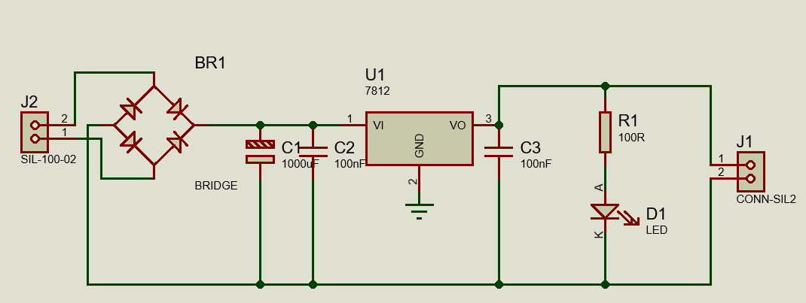
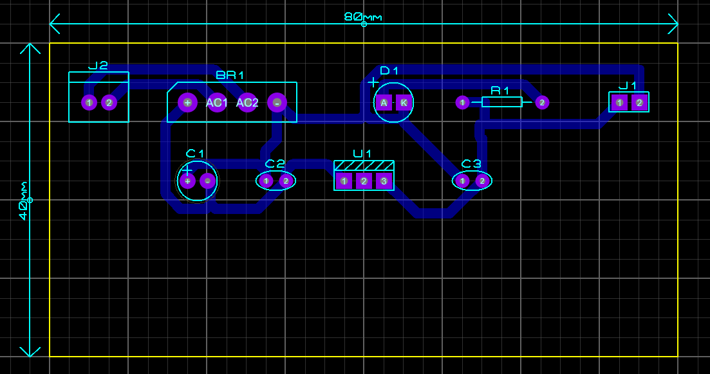
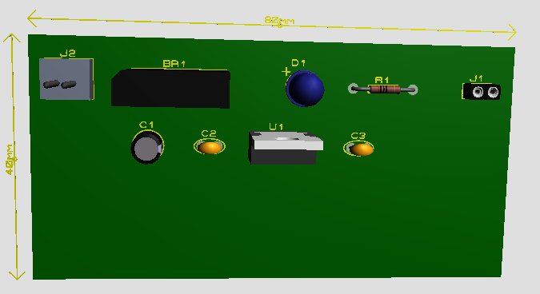
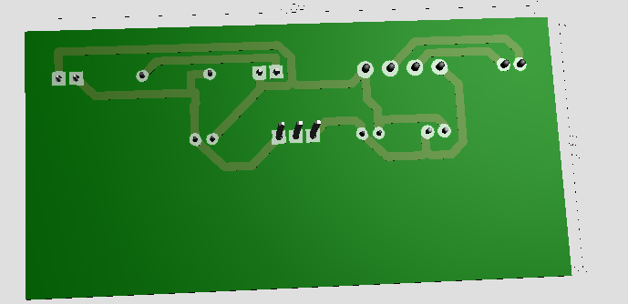

# Carregador feito no Proteus
Trabalho da disciplina de sistemas embarcados

#### Entrada (J2)
Em J2 você aplica uma tensão CA (AC) vinda de um transformador (ou uma CA compatível).
Os dois pinos vão para a ponte retificadora.
#### Retificação em ponte (BR1)
BR1 (ponte de diodos) converte a CA em uma CC pulsante.
A saída “+” da ponte vai para o barramento superior (positivo).
A saída “–” vira o terra/0 V (barramento inferior).
#### Filtragem (C1 + C2)
C1 (1000 µF): é o capacitor “grande” que alisa a tensão CC pulsante, reduzindo a ondulação (ripple). Ele fornece corrente nos “vales” entre os picos.
C2 (100 nF): capacitor pequeno para ruídos de alta frequência (ajuda a evitar oscilações e filtrar picos rápidos).
#### Regulação para 12 V (U1 – 7812)
U1 (7812) é um regulador linear:
VI (pino 1): recebe a tensão CC filtrada.
GND (pino 2): referência (0 V).
VO (pino 3): entrega 12 V estabilizados.
#### Estabilidade na saída (C3)
C3 (100 nF) na saída do 7812 ajuda na estabilidade do regulador e filtra ruídos de alta frequência na linha de 12 V.
#### LED indicador (R1 + D1)
R1 (100 Ω) limita a corrente do LED D1.
D1 acende quando há tensão na saída (12 V), indicando que a fonte está ativa.
#### Saída (J1)
J1 é o conector da saída:
Um pino vai ao +12 V (barramento superior na direita).
O outro pino vai ao GND/0 V (barramento inferior).

## Schematic

## PCB

## 3D (Top/Down)

